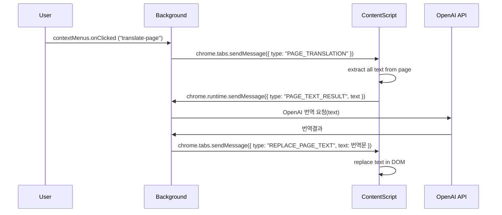

# PARAPARA

```mermaid
sequenceDiagram
    participant U as User
    participant B as Background
    participant C as ContentScript
    participant O as OpenAI API

    U->>B: contextMenus.onClicked ("translate-page")
    B->>C: chrome.tabs.sendMessage({ type: "PAGE_TRANSLATION" })
    C->>C: extract all text from page
    C->>B: chrome.runtime.sendMessage({ type: "PAGE_TEXT_RESULT", text })
    B->>O: OpenAI 번역 요청(text)
    O->>B: 번역결과
    B->>C: chrome.tabs.sendMessage({ type: "REPLACE_PAGE_TEXT", text: 번역문 })
    C->>C: replace text in DOM
```
